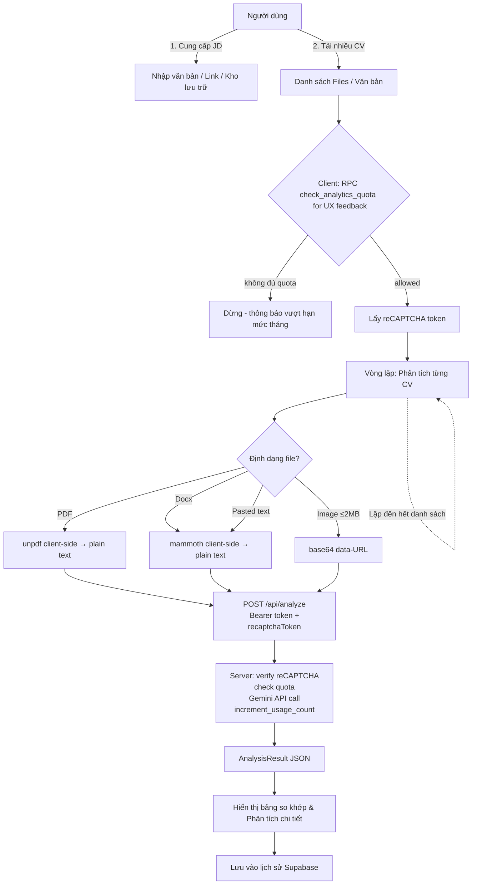

# Quy trình hoạt động (cvFit Workflow)

Dưới đây là mô tả quy trình so sánh hồ sơ năng lực (CV) ứng viên với mô tả công việc (JD).

## 1. Luồng phân tích đồng thời (Batch Analysis Flow)



### Các bước trọng tâm:
1.  **Thu thập JD:** JD có thể được lấy từ nhiều nguồn: nhập tay trực tiếp, trích xuất tự động từ đường link tuyển dụng hoặc chọn nhanh từ **Kho lưu trữ JD cá nhân (JD Store)** (`SavedJdContext` / modal trong `AppContent`). Lưu JD mới: `confirmSaveJD(title, jdContent)`.
2.  **Kiểm tra hạn mức tháng:** `AnalysisRunContext` gọi RPC `check_analytics_quota` client-side (cho UX — hiển thị thông báo nhanh). Quota cũng được enforce server-side trong `/api/analyze`. Hạn mức lấy từ `app_settings.default_monthly_analytics_limit` (mặc định **20**, đổi qua Admin/SQL không cần deploy). Xem [8_analytics.md](8_analytics.md).
3.  **Xử lý file trước khi gửi:** PDF → `unpdf` extract text client-side (không gửi base64 để tránh vượt 4.5MB limit Vercel); Image ≤ 2MB → base64; DOCX → mammoth → text.
4.  **Gemini chạy server-side:** `POST /api/analyze` nhận text/base64, gọi Gemini, trả `AnalysisResult`. `GEMINI_API_KEY` chỉ tồn tại trên server — không expose ra browser (SEC-4).
5.  **So sánh chi tiết (Detailed Comparison):** AI không chỉ chấm điểm mà còn chỉ ra minh chứng trực tiếp (`cvEvidence`) từ hồ sơ để giải thích tại sao một yêu cầu được coi là "Đạt" (Matched) hoặc "Thiếu" (Missing).

## 2. Luồng tối ưu hóa & Xuất bản

1.  Từ kết quả so sánh, người dùng có thể chọn một kết quả cụ thể để xem chi tiết.
2.  **Optimization:** AI đề xuất cách viết lại CV để khớp 100% với JD đó.
3.  **Export:** In (`PrintView` / `window.print()`) xuất CV Markdown đã tối ưu; có sao chép Markdown / plain text từ tab Optimization.
4.  **Hiển thị CV tối ưu:** `fullRewrittenCV` (Markdown GFM từ Gemini) được chuẩn hoá bởi `fullRewrittenCvMarkdown.ts` và render qua `CvMarkdownBody.tsx` (sanitize + typography `.cv-markdown-specimen`).

## 4. Luồng thanh toán Pro (PayOS Flow)

```mermaid
graph TD
    A[Người dùng Free] -->|Nâng cấp| B[UpgradeView]
    B -->|createProCheckout| C[POST /api/payment/create]
    C --> D[PayOS: tạo link thanh toán]
    D -->|redirect| E[PayOS checkout page]
    E -->|success| F[/payment/success]
    E -->|cancel| G[/payment/cancel]
    F -->|confirm + poll 2s| H{plan === 'pro'?}
    H -->|chưa| F
    H -->|rồi| I[Hiển thị thành công → redirect Dashboard]
    D -.->|webhook async| J[POST /api/payment/webhook]
    J -->|verify HMAC-SHA256| K[activate_pro_plan RPC]
    K --> L[Chỉ khi payments pending→paid: gia hạn Pro]
    L -.->|poll / confirm phát hiện| H
```

- **UpgradeView** (`src/components/views/UpgradeView.tsx`): Bảng so sánh Free vs Pro, nút "Nâng cấp ngay — 69.000đ/tháng"; user Pro thấy ngày hết hạn (`plan_expires_at`).
- **paymentService** (`src/services/paymentService.ts`): `POST /api/payment/create` (Bearer), `POST /api/payment/confirm` (fallback sau checkout).
- **PaymentSuccessView** (`src/components/views/PaymentSuccessView.tsx`): Gọi confirm với `orderCode` từ URL, poll `get_user_plan` mỗi 2s (tối đa ~40s).
- **PaymentCancelView** (`src/components/views/PaymentCancelView.tsx`): Thông báo hủy, nút "Quay lại phân tích".
- **Enforcement:** Feature gate qua `isProPlan()` / `get_user_plan` (có `plan_expires_at`).

### Gia hạn cộng dồn (nhiều lần mua Pro)

Mỗi lần thanh toán thành công = một `order_code` trong `payments`. RPC `activate_pro_plan`:

1. **Idempotent theo đơn:** `UPDATE payments SET status='paid' WHERE status='pending' AND order_code=…` — chỉ khi cập nhật được 1 dòng mới gia hạn `profiles` (tránh webhook + confirm cộng đôi cùng một đơn).
2. **Cộng dồn hạn:** Nếu đang Pro và `plan_expires_at` còn hiệu lực (hoặc NULL), cộng thêm `payments.duration_days` (mặc định 30) vào ngày hết hạn hiện tại.
3. **Hết hạn rồi mua lại:** `plan_expires_at` mới = `now() + duration_days` (không cộng vào ngày đã quá hạn).
4. **Quota tháng:** Mỗi lần kích hoạt thành công reset `usage_count` về 0 cho `usage_month` hiện tại (coi như chu kỳ Pro mới).

Admin có thể gia hạn thủ công qua `admin_set_user_plan` (cùng quy tắc cộng dồn).

## 5. Quản lý dữ liệu

-   **History:** Kết quả so sánh được lưu trữ theo tài khoản người dùng, cho phép xem lại các lần so sánh trước đó.
-   **Admin:** Theo dõi `usageCount` / hạn mức tháng; cấu hình **mặc định hệ thống** (`app_settings`, ví dụ 20 lượt/tháng); override hoặc unlimited từng user. Chi tiết: [8_analytics.md](8_analytics.md).
