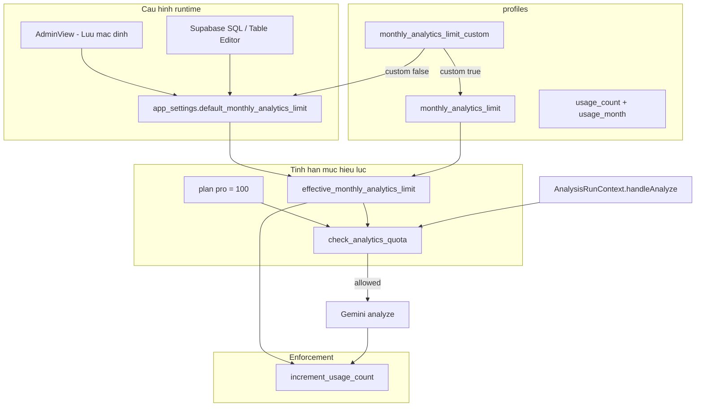

# Phân tích & Đo lường (Analytics)

Tài liệu này gồm **hai chủ đề tách biệt** (đừng nhầm tên):

| Chủ đề | Mục đích | Công cụ / lưu trữ |
|--------|----------|-------------------|
| **Đo lường web (GA4 + Vercel)** | Traffic, funnel, Web Vitals | Google Analytics 4, `@vercel/analytics` |
| **Hạn mức phân tích CV/tháng** | Giới hạn lượt so khớp CV–JD mỗi user | Supabase `app_settings` + `profiles` + RPC + gói **Pro** |
| **Gói Pro (PayOS)** | Thanh toán 69.000đ/tháng, nâng hạn mức & tính năng | `profiles.plan`, `payments`, PayOS webhook |

Phần dưới mô tả lần lượt từng chủ đề.

## Tổng quan kiến trúc

```text
┌─────────────────────────────────────────────────────────────┐
│                        Trình duyệt                          │
├────────────────────────────┬────────────────────────────────┤
│   Vercel Analytics         │   Google Analytics 4 (GA4)   │
│   (@vercel/analytics)      │   gtag.js — load có điều kiện │
│   Luôn mount trong App     │   Chỉ khi consent = granted    │
│   Pageview / Web Vitals    │   Custom events (bảng dưới)    │
└────────────────────────────┴────────────────────────────────┘
```

| Công cụ | Mục đích | Consent | Cấu hình |
|---------|----------|---------|----------|
| **Vercel Analytics** | Lượt xem, Core Web Vitals trên dashboard Vercel | Không qua banner cookie GA | `<Analytics />` trong `src/app/AppShell.tsx` |
| **GA4** | Funnel phân tích CV, JD, lịch sử | Bắt buộc — banner cookie | `VITE_GA_MEASUREMENT_ID` |

**Measurement ID production:** `G-4SB0WWRBQC` (đặt qua biến môi trường, không hardcode trong mã nguồn).

---

## Cookie consent (EU / VN)

GA4 được **nhúng vào `index.html` lúc build** (plugin Vite `inject-google-tag` trong `vite.config.ts`) khi có `VITE_GA_MEASUREMENT_ID`. Trình duyệt tải `gtag/js` ngay — Google Tag Assistant nhận diện được. **Consent Mode** mặc định `analytics_storage: denied`; chỉ sau khi người dùng bấm **Chấp nhận phân tích** thì `ga4.ts` gọi `gtag('consent', 'update', { analytics_storage: 'granted' })` và mới gửi hit phân tích.

### Luồng

1. Lần đầu truy cập (chưa có lựa chọn trong `localStorage`) → hiện `CookieConsentBanner`.
2. **Chấp nhận** → `grantAnalyticsConsent()` → tải gtag, `gtag('config', …)`, gửi event đã xếp hàng.
3. **Từ chối** → `denyAnalyticsConsent()` → không tải Google; xóa hàng đợi event.
4. Lần sau → `restoreAnalyticsConsent()` qua `AnalyticsBootstrap` (mount từ `AppShell`; nếu đã chấp nhận trước đó, tự load GA4).
5. **Đổi ý** → Footer → **Cài đặt cookie** → xóa consent → banner hiện lại.

### Lưu trữ consent

| Khóa `localStorage` | Giá trị |
|---------------------|---------|
| `cv_compare_analytics_consent` | `granted` \| `denied` |

### Cấu hình privacy trên GA4

Khi load, client gửi:

- `anonymize_ip: true`
- `allow_google_signals: false`
- `allow_ad_personalization_signals: false`
- Consent update: `analytics_storage: granted`, quảng cáo (`ad_*`) = `denied`

### File liên quan

| File | Vai trò |
|------|---------|
| `src/lib/ga4.ts` | Consent, `loadGA4()`, `trackEvent()` |
| `src/components/layout/CookieConsentBanner.tsx` | UI banner |
| `src/components/layout/Footer.tsx` | Nút « Cài đặt cookie » |
| `src/components/PrivacyPolicyPage.tsx` | Mô tả pháp lý GA4 + Vercel |

---

## Biến môi trường

| Biến | Bắt buộc | Mô tả |
|------|----------|--------|
| `VITE_GA_MEASUREMENT_ID` | Có (để bật GA4) | ID dạng `G-XXXXXXXXXX`. Ví dụ: `G-4SB0WWRBQC` |

- **Local:** `.env.local` (xem `.env.example`).
- **Vercel (project `cvcompare`):** Settings → Environment Variables → Production + Preview → **Redeploy**.

Nếu thiếu biến này, banner cookie **không** hiện (`isGa4Configured()` = false) và mọi `trackEvent()` là no-op.

---

## API theo dõi sự kiện

Mọi event GA4 đi qua **`trackEvent(name, params?)`** trong `src/lib/ga4.ts`. Không gọi `window.gtag` trực tiếp từ component (trừ bootstrap trong `ga4.ts`).

Điều kiện gửi:

- Consent = `granted`
- `VITE_GA_MEASUREMENT_ID` đã cấu hình
- Script gtag đã load (hoặc event được xếp hàng rồi flush sau khi load)

---

## Bảng event đang track

| Event | Mô tả | Thuộc tính (params) | Trigger | File |
|-------|--------|---------------------|---------|------|
| `jd_create` | Người dùng có JD mới (trích URL hoặc lưu thủ công) | `method`: `'extract_url'` \| `'manual'` | Trích link thành công; lưu JD vào kho | `AnalysisRunContext.tsx` (`extract_url`) — `SavedJdContext.tsx` (`manual`) |
| `analyze_cv` | Bắt đầu một lượt phân tích CV–JD | `input_mode`: `'file'` \| `'text'` — `jd_mode`: `'text'` \| `'link'` — `cv_count`: số file (khi upload) | Đầu `handleAnalyze`, sau reCAPTCHA (production) | `AnalysisRunContext.tsx` |
| `analysis_success` | Một CV hoàn tất phân tích AI | `match_score`: điểm ATS — `jd_type`: chế độ JD — `input_mode`: `'file'` \| `'text'` | Sau mỗi `analyzeCV` thành công | `AnalysisRunContext.tsx` |
| `view_history` | Mở tab Lịch sử | _(không có)_ | Click tab History trên Header | `Header.tsx` |

### Ghi chú quan trọng

- **Không gửi** nội dung CV, JD, email, tên file đầy đủ, hay URL JD lên GA4 (đã bỏ `url` / `cv_name` để giảm rủi ro PII).
- **Không có** event đăng nhập/đăng xuất, xóa lịch sử, hay admin — có thể bổ sung sau qua `trackEvent`.
- GA4 tự thu **page_view** sau `gtag('config', …)` khi script đã load (không cần event tùy chỉnh cho từng tab React).

### Conversion đề xuất (cấu hình trong GA4 Admin)

| Conversion (tên gợi ý) | Event nguồn | Ý nghĩa |
|------------------------|-------------|---------|
| `analysis_completed` | `analysis_success` | Hoàn thành giá trị cốt lõi |
| `jd_saved` | `jd_create` (`method: manual`) | Người dùng lưu JD để dùng lại |
| `analysis_started` | `analyze_cv` | Ý định phân tích (phễu trên) |

Đánh dấu conversion trong **Admin → Events → Mark as conversion** (hoặc tạo custom conversion tương ứng).

---

## Vercel Analytics

- Package: `@vercel/analytics` (`package.json`).
- Component: `<Analytics />` trong `src/app/AppShell.tsx` — **không** phụ thuộc consent GA4.
- Dữ liệu xem trên [Vercel Dashboard](https://vercel.com) → project **`cvfit`** → Analytics.
- Phù hợp: theo dõi traffic, performance; **không** thay thế funnel event tùy chỉnh của GA4.

---

## Hạn mức phân tích CV/tháng (Supabase — không phải GA4)

Giới hạn số lượt **phân tích CV–JD thành công** mỗi user trong **tháng lịch UTC** (`YYYY-MM`). Mặc định hệ thống: **20** lượt/tháng (có thể đổi runtime qua `app_settings`).

### Gói Free vs Pro

| | Free | Pro (PayOS) |
|---|------|-------------|
| Phân tích / tháng | `app_settings` (mặc định 20) hoặc override admin | **100** (trừ khi admin đặt unlimited) |
| CV / lần | 1 | 5 |
| Kho JD | 3 | Không giới hạn |
| Lịch sử | 7 ngày | Toàn bộ |
| Xuất CV tối ưu | Không | Có |

- Cột `profiles.plan`, `plan_expires_at`; RPC `get_user_plan`, `activate_pro_plan` (webhook PayOS).
- Migration: `supabase/migrations/20260601000000_add_plan_to_profiles.sql`.
- UI: `/upgrade`, `/payment/success`, `/payment/cancel`.

### Bảo mật RPC (Security Advisor)

- Client đăng nhập (`authenticated` JWT) gọi: `check_analytics_quota`, `get_user_plan`, `increment_usage_count`, `sync_profile_usage_month`.
- **`activate_pro_plan`** chỉ backend PayOS webhook (`SUPABASE_SERVICE_ROLE_KEY`) — không gọi từ browser.
- Role **`anon`** đã bị revoke execute trên các RPC trên (migrations `20260601110000`–`20260601140000`).

### Kiến trúc



### Bảng & cột

| Đối tượng | Cột / key | Ý nghĩa |
|-----------|-----------|---------|
| **`app_settings`** | `key = 'default_monthly_analytics_limit'`, `value` (jsonb số) | Hạn mức **mặc định toàn hệ thống**. Đổi tại đây **không cần deploy** Vercel. |
| **`profiles`** | `monthly_analytics_limit_custom` | `false` → theo `app_settings`. `true` → dùng override cột dưới. |
| **`profiles`** | `monthly_analytics_limit` | Chỉ khi `custom = true`: số ≥ 0, hoặc `NULL` = **không giới hạn**. |
| **`profiles`** | `usage_count`, `usage_month` | Số lượt **thành công** trong tháng UTC; `sync_profile_usage_month` reset `usage_count` khi sang tháng mới. |

### Hàm SQL (Supabase)

| Hàm | Vai trò |
|-----|---------|
| `get_default_monthly_analytics_limit()` | Đọc `app_settings` (fallback **20**). |
| `effective_monthly_analytics_limit(custom, stored_limit)` | `custom = false` → global default; `custom = true` → `stored_limit` (`NULL` = unlimited). |
| `check_analytics_quota(user_id, additional?)` | Trả JSON `allowed`, `used`, `limit`, `month`, `reason`. Gọi **trước** khi chạy batch analyze. |
| `increment_usage_count(user_id)` | Tăng `usage_count` sau mỗi CV thành công; chặn nếu đã đạt limit. |
| `sync_profile_usage_month(user_id)` | Reset usage khi `usage_month` ≠ tháng UTC hiện tại. |
| `current_usage_month()` | Chuỗi `YYYY-MM` (UTC). |

### Migration (thứ tự)

Chạy **theo thứ tự timestamp** trong `supabase/migrations/`:

| File | Nội dung |
|------|----------|
| `20260520120000_profiles_monthly_analytics_limit.sql` | Cột `monthly_analytics_limit`, `usage_month`, RPC quota cơ bản. |
| `20260520130000_profiles_default_monthly_limit_20.sql` | `DEFAULT 20` trên cột profile (thế hệ cũ — trước `app_settings`). |
| `20260523100000_app_settings_analytics_default.sql` | Bảng `app_settings`, cột `monthly_analytics_limit_custom`, hàm effective limit, cập nhật RPC, RLS, backfill. |

Áp dụng: `supabase db push` hoặc chạy từng file trong SQL Editor.

**Backfill** (migration `20260523100000`):

- `monthly_analytics_limit = 20` → `monthly_analytics_limit_custom = false` (theo mặc định hệ thống).
- `NULL` hoặc giá trị **khác 20** → `custom = true` (giữ override / unlimited như trước).

User mới (`createUserProfile`): `monthly_analytics_limit_custom = false`, **không** ghi cứng `20` trên client.

### Luồng ứng dụng

1. User bấm phân tích → `AnalysisRunContext.handleAnalyze` gọi `checkAnalyticsQuota(userId, plannedRuns)` (`src/services/analyticsQuotaService.ts`).
2. Nếu `allowed = false` → hiển thị `monthlyUsageLimitExceeded` / `monthlyUsageLimitExceededDetail` (không gọi Gemini).
3. Mỗi CV thành công → `increment_usage_count` (server-side, qua service hiện có).

### Admin UI (`AdminView`)

| Thao tác | Hành vi |
|----------|---------|
| **Hạn mức phân tích mặc định / tháng** (đầu tab Users) | Ghi `app_settings` qua `updateDefaultMonthlyAnalyticsLimit` — áp dụng cho mọi user `custom = false`. |
| Cột « Phân tích / tháng » | Hiển thị `usage_count / effectiveLimit` (`resolveEffectiveMonthlyAnalyticsLimit` + global default đã load). |
| Nhập số + blur | `updateUserMonthlyAnalyticsLimit` → `custom = true`, lưu limit. |
| Ô trống + blur (khi đã custom) | `monthly_analytics_limit = NULL` → **không giới hạn**. |
| **Dùng mặc định** | `resetUserToGlobalAnalyticsLimit` → `custom = false` (nhận lại giá trị từ `app_settings`). |
| Blur ô trống khi **chưa** custom | Không gọi API (tránh vô tình set unlimited). |

### File mã nguồn

| File | Vai trò |
|------|---------|
| `src/services/appSettingsService.ts` | `getDefaultMonthlyAnalyticsLimit`, `updateDefaultMonthlyAnalyticsLimit` |
| `src/services/userService.ts` | Profile map, `resolveEffectiveMonthlyAnalyticsLimit`, `resetUserToGlobalAnalyticsLimit` |
| `src/services/analyticsQuotaService.ts` | Client gọi RPC `check_analytics_quota` |
| `src/context/analysis/AnalysisRunContext.tsx` | Kiểm tra quota trước analyze |
| `src/components/views/AdminView.tsx` | UI cấu hình global + override từng user |
| `src/translations/admin.ts` | Nhãn VI/EN cho cấu hình global |

### Đổi hạn mức **không deploy** Vercel

**Cách 1 — Admin UI:** Tab Users → « Hạn mức phân tích mặc định / tháng » → nhập số → **Lưu mặc định**.

**Cách 2 — Supabase Dashboard:** Table Editor → `app_settings` → sửa `value` của row `default_monthly_analytics_limit`.

**Cách 3 — SQL:**

```sql
UPDATE public.app_settings
SET value = '30'::jsonb,
    updated_at = now()
WHERE key = 'default_monthly_analytics_limit';
```

Chỉ user có `monthly_analytics_limit_custom = false` nhận giá trị mới. User admin đã set override (`custom = true`) **không** đổi theo global.

### RLS `app_settings`

- **SELECT:** mọi user `authenticated` (client đọc default để hiển thị Admin).
- **INSERT/UPDATE/DELETE:** chỉ `public.is_admin()`.

### Kiểm tra (quota)

1. User `custom = false`, global = 20, `usage_count = 20` → lượt 21 bị `check_analytics_quota` từ chối.
2. `UPDATE app_settings` → 30 → cùng user được thêm quota (không redeploy frontend).
3. User `custom = true`, `monthly_analytics_limit = 5` → vẫn 5 dù global = 30.
4. User `custom = true`, `monthly_analytics_limit IS NULL` → unlimited.
5. Sang tháng UTC mới → `usage_count` reset về 0 (giữ limit).

### Thông báo lỗi (UI)

| Key dịch | Khi nào |
|----------|---------|
| `monthlyUsageLimitExceeded` | Vượt hạn mức (tiêu đề ngắn) |
| `monthlyUsageLimitExceededDetail` | `{used} / {limit}` chi tiết |

Định nghĩa trong `src/translations/system.ts`.

**Không** liên quan Google Analytics hay Vercel Analytics.

---

## Kiểm tra & debug

### GA4

1. Cài [Google Analytics Debugger](https://chrome.google.com/webstore) hoặc dùng **DebugView** (Admin → DebugView).
2. Mở site → **Chấp nhận** cookie → Network có request tới `googletagmanager.com/gtag/js?id=G-4SB0WWRBQC`.
3. Chạy một lượt phân tích CV → DebugView thấy `analyze_cv`, sau đó `analysis_success`.
4. **Từ chối** cookie → không có request Google; `trackEvent` không gửi gì.

### Vercel

- Deploy lên `cvfit` → tab Analytics trên Vercel sau vài phút có pageview.

---

## Mở rộng event mới

1. Gọi `trackEvent('ten_event', { ... })` tại điểm hành vi có ý nghĩa (intent / completion).
2. Cập nhật bảng event trong file này.
3. (Tùy chọn) Đăng ký / đánh dấu conversion trong GA4 Admin.
4. Tránh PII và nội dung CV/JD trong `params`.

Ví dụ:

```ts
import { trackEvent } from '../lib/ga4';

trackEvent('signup_completed', { method: 'google' });
```

---

## Tài liệu liên quan

- [2_tech_stack.md](2_tech_stack.md) — Stack tổng quan
- [3_frontend.md](3_frontend.md) — Context và component UI
- [5_api.md](5_api.md) — RPC Supabase (`check_analytics_quota`, …)
- [6_workflow.md](6_workflow.md) — Luồng phân tích có bước kiểm tra quota
- [7_deployment.md](7_deployment.md) — Migration Supabase & biến môi trường Vercel
