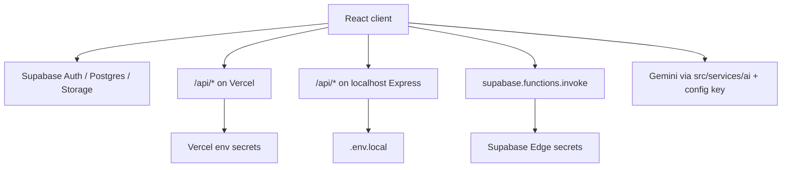

# API routing matrix (Vercel · Express · Supabase)

Canonical reference for **which runtime handles each capability**. The frontend uses different paths in production (Vercel) vs local Express (`npm start`). Supabase Edge Functions are invoked directly from the client via `supabase.functions.invoke`.

## Quick reference

| Capability | Vercel (`api/`) | Express (`server/routes/`) | Supabase Edge |
|------------|-----------------|---------------------------|---------------|
| Public config (e.g. Gemini key) | `GET /api/config` → `api/config.ts` | `server/routes/config` | — |
| PDF text extract | `POST /api/extract-pdf` → `api/extract-pdf.ts` | `POST /api/extract-pdf/extract` → `server/routes/pdf.ts` | `extract-pdf` (optional; some JD flows) |
| reCAPTCHA verify | `POST /api/verify-recaptcha` → `api/verify-recaptcha.ts` | `POST /api/verify-recaptcha/verify` | `verify-recaptcha` (analyze flow in `AnalysisRunContext`) |
| Feedback email | `POST /api/send-feedback` → `api/send-feedback.ts` | mirror under `server/routes/` | — |
| Welcome email | `POST /api/send-welcome-email` → `api/send-welcome-email.ts` | mirror | `send-email` (if configured) |

Rewrites are defined in [`vercel.json`](../vercel.json).

## Request flow (high level)

## When to use which stack

### Vercel serverless (`api/*.ts`)

- **Production** deployment on Vercel.
- Same URL shape as the app (`/api/...`); `vercel.json` maps sources to handler files.
- Use for secrets that must not ship in the client bundle (Resend, reCAPTCHA server verify, PDF parsing on server).

### Express (`npm start` → `server.ts` + `server/routes/`)

- **Local development** full-stack: Vite dev server proxies or hits Express for `/api`.
- Path suffixes may differ from Vercel (e.g. `/api/extract-pdf/extract` vs `/api/extract-pdf`).
- Keep handlers in sync with `api/` when adding endpoints.

### Supabase Edge Functions (`supabase/functions/`)

- Invoked from the browser with the user's session JWT where applicable.
- **`verify-recaptcha`:** Called before CV analysis in non-localhost environments (`AnalysisRunContext`).
- **`extract-pdf`:** Optional alternative for PDF/JD extraction in some UI flows (see `AnalysisInputView` and related code).
- **`send-email`:** Welcome or transactional email if wired to Edge instead of Vercel.

Do **not** assume one Edge function replaces Express and Vercel handlers without checking call sites.

## Supabase data plane (not HTTP `/api`)

| Concern | Client module | Notes |
|---------|---------------|--------|
| Auth | `src/lib/supabase.ts` | Google OAuth, session |
| History / saved JDs | `src/services/historyService.ts` | Postgres via Supabase client |
| Storage bucket `cv-files` | Supabase Storage API | Bucket created in project; no dedicated `storageService.ts` in app code |

## Adding a new endpoint

1. Implement **Vercel** handler under `api/`.
2. Add **Express** route under `server/routes/` for local parity.
3. Add **rewrite** in `vercel.json` if the path is new.
4. Update this matrix and [`docs/5_api.md`](./5_api.md).

## Out of scope (this doc)

- Merging `api/` and `server/` into a single deployable.
- Changing analyze or auth behavior.
