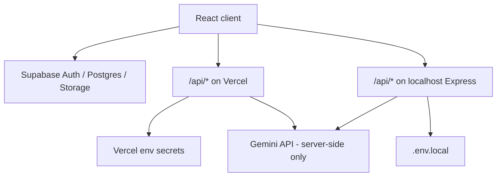

# API routing matrix (Vercel · Express · Supabase)

Canonical reference for **which runtime handles each capability**. Từ 2026-06, **tất cả path và logic đều thống nhất** — không có sự khác biệt giữa Express (local dev) và Vercel (production). Business logic nằm trong `_server-lib/`, route handlers là thin wrappers.

## Quick reference

| Capability | Vercel (`api/`) | Express (`server/routes/`) | Shared logic |
|------------|-----------------|---------------------------|--------------|
| Public config (Supabase keys) | `GET /api/config` → `api/config.ts` | `server/routes/config.ts` | Inline (env vars only) |
| **Gemini CV analysis** (chấm điểm, sync) | `POST /api/analyze` → `api/analyze.ts` (60s timeout, 50s wall-clock budget nội bộ) | `POST /api/analyze` → `server/routes/analyze.ts` | `_server-lib/analyze/handler.ts` |
| **Gemini CV rewrite** (nền, `fullRewrittenCV`) | `POST /api/rewrite-cv` → `api/rewrite-cv.ts` (60s timeout) | `POST /api/rewrite-cv` → `server/routes/rewriteCv.ts` | `_server-lib/rewriteCv/handler.ts` |
| **Gemini CV parse** (nền, `parsedCV`) | `POST /api/parse-cv` → `api/parse-cv.ts` (60s timeout) | `POST /api/parse-cv` → `server/routes/parseCv.ts` | `_server-lib/parseCv/handler.ts` |
| PDF text extract | `POST /api/extract-pdf` → `api/extract-pdf.ts` (Auth: Bearer or reCAPTCHA) | `POST /api/extract-pdf` → `server/routes/pdf.ts` (idem) | `_server-lib/pdf/handler.ts` |
| reCAPTCHA verify (auth flow) | `POST /api/verify-recaptcha` → `api/verify-recaptcha.ts` | `POST /api/verify-recaptcha` → `server/routes/recaptcha.ts` | `_server-lib/recaptcha.ts` |
| Feedback email | `POST /api/send-email` (`type:'feedback'`) → `api/send-email.ts` | `POST /api/send-feedback` → `server/routes/feedback.ts` | `_server-lib/email/handlers.ts` |
| Welcome email | `POST /api/send-email` (`type:'welcome'`) → `api/send-email.ts` | `POST /api/send-welcome-email` → `server/routes/welcomeEmail.ts` | `_server-lib/email/handlers.ts` |
| VIP upgrade email | server-side via `_server-lib/payment/vipUpgradeEmail.ts` | — | — |
| PayOS — tạo link | `POST /api/payment/create` → `api/payment.ts` (unified) | `POST /api/payment/create` → `server/routes/payment.ts` | `_server-lib/payment/handlers.ts` |
| PayOS — webhook | `POST /api/payment/webhook` → `api/payment.ts` | `POST /api/payment/webhook` → `server/routes/payment.ts` | `_server-lib/payment/handlers.ts` |
| PayOS — confirm (fallback) | `POST /api/payment/confirm` → `api/payment.ts` | `POST /api/payment/confirm` → `server/routes/payment.ts` | `_server-lib/payment/handlers.ts` |
| Recruiter — lưu phân tích | `POST /api/recruiter/save-analysis` → `api/recruiter/save-analysis.ts` | `POST /api/recruiter/save-analysis` → `server/routes/recruiter.ts` | Inline (RPC call) |

Rewrites are defined in [`vercel.json`](../vercel.json).

**PayOS:** `POST /api/payment/create` yêu cầu `Authorization: Bearer <supabase_access_token>` (JWT được cache 5 phút in-memory). Webhook không dùng JWT; xác thực 2 lớp — HMAC-SHA256 + timestamp freshness (±30 phút, `transactionDateTime` UTC+7) để chống replay attack. Biến môi trường: `PAYOS_CLIENT_ID`, `PAYOS_API_KEY`, `PAYOS_CHECKSUM_KEY`, `SUPABASE_SERVICE_ROLE_KEY`, `APP_URL`.

**Recruiter save-analysis:** `POST /api/recruiter/save-analysis` yêu cầu `Authorization: Bearer <supabase_access_token>`. Dùng service role để ghi kết quả phân tích vào bảng recruiter campaigns.

**Gemini CV rewrite/parse (nền):** Cả hai đều dùng mô hình wall-clock budget 50s giống `/api/analyze` (deadline tính từ đầu request, ngân sách còn lại sau auth/reCAPTCHA truyền thẳng cho Gemini) để đảm bảo luôn trả JSON hợp lệ trước khi Vercel hard-kill ở 60s. Chi tiết: [5_api.md](./5_api.md).

## Request flow (high level)

> **SEC-4 (2026-06):** Gemini không còn được gọi trực tiếp từ browser. `GEMINI_API_KEY` chỉ tồn tại trên server. Frontend gửi `POST /api/analyze` → backend xử lý toàn bộ AI call.

## When to use which stack

### Vercel serverless (`api/*.ts`)

- **Production** deployment on Vercel.
- Same URL shape as the app (`/api/...`); `vercel.json` maps sources to handler files.
- Use for secrets that must not ship in the client bundle (Resend, reCAPTCHA server verify, PDF parsing on server).

### Express (`npm start` → `server.ts` + `server/routes/`)

- **Local development** full-stack: Vite dev server proxies or hits Express for `/api`.
- **Paths và behavior giống hệt Vercel** — cả hai gọi cùng `_server-lib/` handlers.
- Rate limiting via `server/lib/rateLimiter.ts` (thay thế cho Vercel edge rate limiting).

### Supabase Edge Functions (`supabase/functions/`)

- **`verify-recaptcha`:** Legacy — **không còn dùng cho analyze flow**. reCAPTCHA verify cho analyze giờ chạy inline trong `POST /api/analyze`. Vẫn còn dùng cho auth flow (`AuthContext.tsx`).
- **`extract-pdf`:** Legacy — không còn được gọi từ frontend. PDF extraction dùng `unpdf` client-side (trong `useFileProcessor.ts`) trước khi gửi text lên `/api/analyze`.

Do **not** assume one Edge function replaces Express and Vercel handlers without checking call sites.

## Supabase data plane (not HTTP `/api`)

| Concern | Client module | Notes |
|---------|---------------|--------|
| Auth | `src/lib/supabase.ts` + `src/context/AuthContext.tsx` | Google OAuth + Email/Password (Supabase Auth), reCAPTCHA v3 verify qua `/api/verify-recaptcha` trước sign in/sign up |
| History / saved JDs | `src/services/historyService.ts` | Postgres via Supabase client |
| Storage bucket `cv-files` | Supabase Storage API | Bucket created in project; no dedicated `storageService.ts` in app code |

## Adding a new endpoint

1. Implement **shared handler** in `_server-lib/<module>/handler.ts` — tất cả business logic ở đây.
2. Add **Vercel** thin wrapper under `api/` (unpack headers/body → call handler → return result).
3. Add **Express** thin wrapper under `server/routes/` (mount on router, same pattern).
4. Add **rewrite** in `vercel.json` if the path is new.
5. Update this matrix and [`docs/5_api.md`](./5_api.md).

## Out of scope (this doc)

- Merging `api/` and `server/` into a single deployable.
- Changing analyze or auth behavior.
