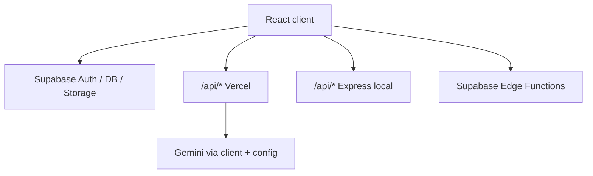

# Structure Optimization Implementation Plan

> **For agentic workers:** REQUIRED SUB-SKILL: Use superpowers:subagent-driven-development (recommended) or superpowers:executing-plans to implement this plan task-by-task. Steps use checkbox (`- [ ]`) syntax for tracking.

**Goal:** Clean up repo artifacts, split `App.tsx` and analysis context into focused modules, and document API routing across Vercel/Express/Supabase — without changing product behavior.

**Architecture:** Three sequential PRs. Phase 1 is gitignore + file deletes only. Phase 2 extracts `src/app/*` from `App.tsx` and splits `AnalysisContext` into `AnalysisRunProvider` + `SavedJdProvider` with a composing `AnalysisProvider` and merged `useAnalysis()`. Phase 3 adds `docs/9_api_routes.md`.

**Tech Stack:** React 19, Vite, TypeScript, Express (`server.ts`), Vercel serverless (`api/`), Supabase.

**Spec:** `docs/superpowers/specs/2026-05-20-structure-optimization-design.md`

---

## File map (end state)

| Path | Responsibility |
|------|----------------|
| `src/App.tsx` | Re-export `AppShell` default |
| `src/app/AppShell.tsx` | Providers, ErrorBoundary, Analytics |
| `src/app/AppContent.tsx` | Tabs, layout, chrome |
| `src/app/AppErrorBoundary.tsx` | Error boundary UI |
| `src/app/SavedJdModal.tsx` | Save JD modal |
| `src/app/MobileBottomNav.tsx` | Mobile bottom nav |
| `src/context/analysis/AnalysisRunContext.tsx` | CV/JD inputs, analyze, history, results |
| `src/context/analysis/SavedJdContext.tsx` | Saved JD CRUD |
| `src/context/analysis/AnalysisProvider.tsx` | Compose providers + `useAnalysis()` |
| `src/context/analysis/types.ts` | `AnalysisContextType` |
| `src/context/analysis/index.ts` | Public exports |
| `docs/9_api_routes.md` | Routing matrix + Mermaid |

---

# PR1 — Phase 1: Repo hygiene

### Task 1: Graphify gitignore

**Files:**
- Modify: `.gitignore`
- Modify: git index (no file content change except untrack)

- [ ] **Step 1: Update `.gitignore`**

Replace the block:

```gitignore
# Graphify AST cache (regenerated by `graphify update`; keep GRAPH_REPORT.md / graph.json if needed)
graphify-out/cache/
```

With:

```gitignore
# Graphify — regenerate with `graphify update .`; keep human-readable report only
graphify-out/*
!graphify-out/GRAPH_REPORT.md
```

- [ ] **Step 2: Untrack generated graphify files**

```bash
cd "/Users/nghiepnguyen/My Files/cv-compare-tn"
git rm -r --cached graphify-out/ 2>/dev/null || true
git add graphify-out/GRAPH_REPORT.md
git add .gitignore
git status
```

Expected: `GRAPH_REPORT.md` staged; other `graphify-out/*` untracked or deleted from index.

- [ ] **Step 3: Verify lint/build**

```bash
npm run lint
npm run build
```

Expected: exit code 0 both.

- [ ] **Step 4: Commit PR1 part 1**

```bash
git commit -m "$(cat <<'EOF'
chore: ignore graphify artifacts except GRAPH_REPORT.md

EOF
)"
```

---

### Task 2: Remove root clutter and dead storage service

**Files:**
- Delete: `grep_output.txt`, `tags.txt` (if present)
- Delete or move: `test-resend.ts` → prefer `scripts/test-resend.ts` if still useful
- Delete: `src/services/storageService.ts`
- Modify: `CODING_CONVENTIONS.md`, `docs/3_frontend.md`, `docs/5_api.md`, `docs/7_deployment.md`

- [ ] **Step 1: Confirm storageService unused**

```bash
rg "storageService" src/
```

Expected: no matches.

- [ ] **Step 2: Delete clutter files**

```bash
rm -f grep_output.txt tags.txt
# If keeping resend script:
mkdir -p scripts && git mv test-resend.ts scripts/test-resend.ts 2>/dev/null || rm -f test-resend.ts
rm -f src/services/storageService.ts
```

- [ ] **Step 3: Update docs**

In `CODING_CONVENTIONS.md` line ~15, change example to `ResultView.tsx`.

In `docs/3_frontend.md`, remove `storageService` from service list.

In `docs/5_api.md` §2 Storage, replace `` `storageService.ts` `` with: bucket `cv-files` (Supabase Storage; uploads not wired in current UI).

In `docs/7_deployment.md`, same bucket note without `storageService.ts` path.

- [ ] **Step 4: Verify and commit**

```bash
npm run lint
npm run build
git add -A
git commit -m "$(cat <<'EOF'
chore: remove dead storage service and root clutter

EOF
)"
```

---

# PR2 — Phase 2a: Split App.tsx

### Task 3: Extract ErrorBoundary

**Files:**
- Create: `src/app/AppErrorBoundary.tsx`
- Modify: `src/App.tsx` (temporary — until Task 6)

- [ ] **Step 1: Create `src/app/AppErrorBoundary.tsx`**

Move the `ErrorBoundary` class from `src/App.tsx` (lines 42–79) verbatim into new file; export as `AppErrorBoundary`.

- [ ] **Step 2: Import in App.tsx**

Replace inline class with `import { AppErrorBoundary } from './app/AppErrorBoundary'` and use `<AppErrorBoundary>` in tree.

- [ ] **Step 3: Lint**

```bash
npm run lint
```

---

### Task 4: Extract SavedJdModal and MobileBottomNav

**Files:**
- Create: `src/app/SavedJdModal.tsx`
- Create: `src/app/MobileBottomNav.tsx`
- Modify: `src/App.tsx`

- [ ] **Step 1: Extract modal**

Move the save-JD `AnimatePresence` block from `AppContent` into `SavedJdModal.tsx`. Props interface:

```typescript
export interface SavedJdModalProps {
  isOpen: boolean;
  onClose: () => void;
  jdSaveTitle: string;
  onJdSaveTitleChange: (v: string) => void;
  onConfirm: () => void;
  isSavingJD: boolean;
  t: { saveJdTitle: string; saveJdPlaceholder: string; saveJdCancel: string; saveJdSaving: string; saveJdConfirm: string };
}
```

- [ ] **Step 2: Extract mobile nav**

Move bottom navigation JSX + handlers into `MobileBottomNav.tsx`; props: `activeTab`, `setActiveTab`, `t` labels from `formatLabel`/`useUI` passed from parent.

- [ ] **Step 3: Wire in App.tsx / upcoming AppContent**

- [ ] **Step 4: `npm run lint`**

---

### Task 5: Extract AppContent and AppShell

**Files:**
- Create: `src/app/AppContent.tsx` — move `function AppContent` body from `App.tsx`
- Create: `src/app/AppShell.tsx` — `AuthProvider`, `UIProvider`, `AnalysisProvider`, `AppErrorBoundary`, `Suspense`, `AnalyticsBootstrap`, `Analytics`
- Modify: `src/App.tsx` — single line re-export

- [ ] **Step 1: Create AppContent**

Move `AppContent` and its hooks imports; keep lazy view imports.

- [ ] **Step 2: Create AppShell**

```typescript
export default function AppShell() {
  return (
    <AppErrorBoundary>
      <AuthProvider>
        <UIProvider>
          <AnalysisProvider>
            <React.Suspense fallback={...}>
              <AppContent />
            </React.Suspense>
            <AnalyticsBootstrap />
            <Analytics />
          </AnalysisProvider>
        </UIProvider>
      </AuthProvider>
    </AppErrorBoundary>
  );
}
```

- [ ] **Step 3: Thin `src/App.tsx`**

```typescript
export { default } from './app/AppShell';
```

- [ ] **Step 4: Build verify**

```bash
npm run lint && npm run build
```

- [ ] **Step 5: Commit**

```bash
git commit -m "$(cat <<'EOF'
refactor: split App shell into src/app modules

EOF
)"
```

---

# PR2 — Phase 2b: Two analysis providers

### Task 6: Create analysis context modules

**Files:**
- Create: `src/context/analysis/types.ts`
- Create: `src/context/analysis/AnalysisRunContext.tsx`
- Create: `src/context/analysis/SavedJdContext.tsx`
- Create: `src/context/analysis/AnalysisProvider.tsx`
- Create: `src/context/analysis/index.ts`
- Delete: `src/context/AnalysisContext.tsx` (after migration)
- Modify: imports in `src/app/AppShell.tsx`, views, `Header.tsx`

- [ ] **Step 1: Add `types.ts`**

Copy `AnalysisContextType` interface from `AnalysisContext.tsx`. Export `SavedJD` re-export from `historyService` if needed.

Update save signature in interface:

```typescript
confirmSaveJD: (title: string, jdContent: string) => Promise<void>;
```

- [ ] **Step 2: Implement `SavedJdContext.tsx`**

Move state: `savedJDs`, `isLoadingSavedJDs`, `isSavingJD`, `loadSavedJDs`, `handleDeleteSavedJD`.

Implement:

```typescript
const confirmSaveJD = async (title: string, jdContent: string) => {
  if (!user) return;
  setIsSavingJD(true);
  try {
    await saveJDToProfile(user.id, title, jdContent);
    await loadSavedJDs();
    trackEvent('jd_create', { method: 'manual' });
  } catch (err: unknown) {
    const message = err instanceof Error ? err.message : String(err);
    setError("Lỗi khi lưu JD: " + message);
  } finally {
    setIsSavingJD(false);
  }
};
```

`useEffect` on `user?.id` to load/clear saved JDs (from original provider).

- [ ] **Step 3: Implement `AnalysisRunContext.tsx`**

Move all remaining state and handlers: inputs, `handleAnalyze`, `handleExtractJD`, history, results, `processFile`, `cleanText`, reCAPTCHA block inside `handleAnalyze`.

Keep `useEffect` on `user?.id` for `loadHistory` only in run provider.

- [ ] **Step 4: Implement composer `AnalysisProvider.tsx`**

```typescript
export function AnalysisProvider({ children }: { children: React.ReactNode }) {
  return (
    <AnalysisRunProvider>
      <SavedJdProvider>{children}</SavedJdProvider>
    </AnalysisRunProvider>
  );
}

export function useAnalysis(): AnalysisContextType {
  const run = useContext(AnalysisRunContext);
  const saved = useContext(SavedJdContext);
  if (!run || !saved) throw new Error('useAnalysis must be used within AnalysisProvider');
  return { ...run, ...saved };
}

export { useAnalysisRun } from './AnalysisRunContext';
export { useSavedJds } from './SavedJdContext';
```

- [ ] **Step 5: `index.ts` exports**

```typescript
export { AnalysisProvider, useAnalysis, useAnalysisRun, useSavedJds } from './AnalysisProvider';
export type { AnalysisContextType } from './types';
```

- [ ] **Step 6: Update imports**

Replace:

```typescript
from './context/AnalysisContext'
```

With:

```typescript
from './context/analysis'
```

Files: `AppShell.tsx` (or `App.tsx` path), `Header.tsx`, `DashboardView.tsx`, `AnalysisInputView.tsx`, `HistoryView.tsx`, `ResultView.tsx`.

- [ ] **Step 7: Update save-JD call site**

In `AppContent.tsx` or `SavedJdModal` parent, change confirm handler:

```typescript
const onConfirmSaveJD = () => {
  void confirmSaveJD(jdSaveTitle.trim(), jd);
  // close modal state...
};
```

- [ ] **Step 8: Delete old file**

```bash
rm src/context/AnalysisContext.tsx
```

- [ ] **Step 9: Verify**

```bash
npm run lint && npm run build
```

Manual: open save-JD modal, save, delete saved JD.

- [ ] **Step 10: Commit**

```bash
git commit -m "$(cat <<'EOF'
refactor: split analysis into run and saved-JD providers

EOF
)"
```

---

# PR3 — Phase 3: API routes documentation

### Task 7: Write `docs/9_api_routes.md`

**Files:**
- Create: `docs/9_api_routes.md`
- Modify: `AGENTS.md`, `docs/5_api.md`

- [ ] **Step 1: Create doc with matrix and Mermaid**

Include sections from spec: capability table, localhost vs production notes, Supabase `functions.invoke` for analyze reCAPTCHA and optional `extract-pdf`, storage bucket `cv-files`, link to `vercel.json` rewrites.

Example Mermaid:



- [ ] **Step 2: Link from AGENTS.md**

Under § File Processing / Backend Integration, add: See [API routing matrix](docs/9_api_routes.md).

- [ ] **Step 3: Pointer in docs/5_api.md**

Add at top after title:

```markdown
> **Routing matrix (Vercel vs Express vs Edge):** [9_api_routes.md](./9_api_routes.md)
```

- [ ] **Step 4: Commit**

```bash
git add docs/9_api_routes.md AGENTS.md docs/5_api.md
git commit -m "$(cat <<'EOF'
docs: add API routing matrix for Vercel, Express, and Edge

EOF
)"
```

---

## Self-review (spec coverage)

| Spec requirement | Task |
|------------------|------|
| graphify keep GRAPH_REPORT only | Task 1 |
| Delete storageService + docs | Task 2 |
| Root clutter | Task 2 |
| CODING_CONVENTIONS fix | Task 2 |
| App split | Tasks 3–5 |
| B2 two providers | Task 6 |
| Skip LandingView | — |
| docs/9_api_routes | Task 7 |
| lint/build gates | Each task |

---

## Execution handoff

Plan saved to `docs/superpowers/plans/2026-05-20-structure-optimization.md`.

**Two execution options:**

1. **Subagent-Driven (recommended)** — fresh subagent per task, review between tasks  
2. **Inline Execution** — implement PR1 → PR2 → PR3 in this session with checkpoints  

Which approach do you want?
